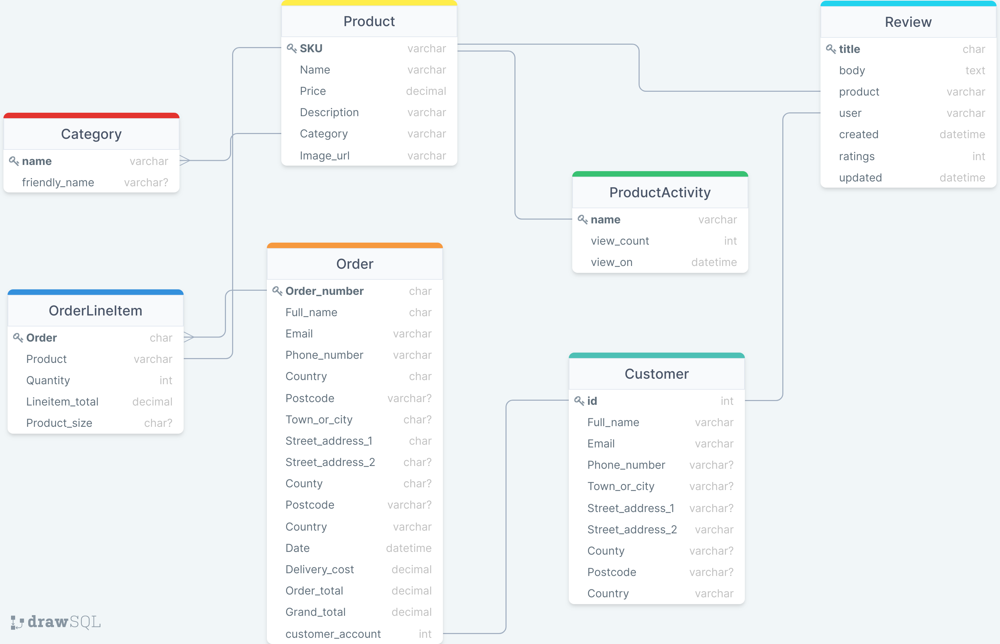
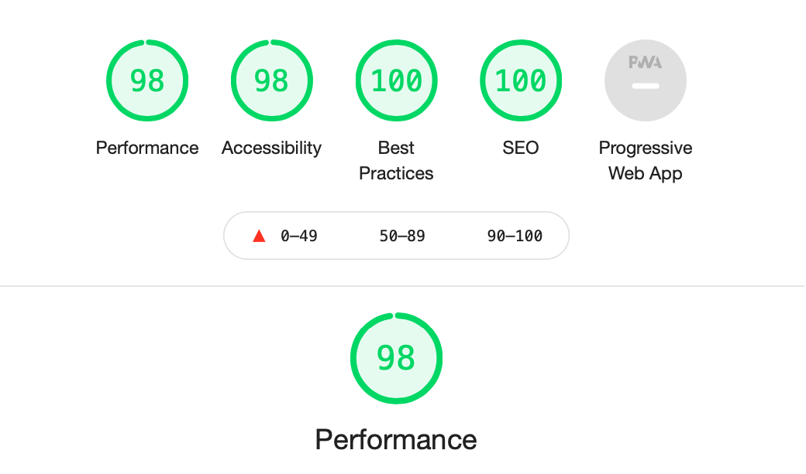

[![homepage][1]][2]

[1]:  static/readme_files/multiscreen-mockup.png
[2]:  https://irishcraft.onrender.com/ "Redirect to homepage"

**IrishCraft Website**
==================
Table of contents:
-----------------

 - [Description](#description)
 - [User Experience](#user-experience)
     - User Stories
     - Strategy
     - Scope
     - Structure
     - Skeleton
     - Surface
 - [Technologies](#technologies)
 - [Testing](#testing)
     - Acceptance Criteria
     - Browser Compatibility
     - OS Compatibility
     - Devices Compatibility
     - W3 HTML Validation
     - W3 CSS Validation 
     - CSS Lint Validation 
     - JSHint Validation
     - Python PEP8 Validation
     - Lightspeed Performance Test
     - Regression Testing
     - User Testing
     - Automated Testing
     - Bugs
 - [Deployment](#deployment)
 - [Credits](#credits)
     - Code Used
     - Content
     - Acknowledgements

Description
-----------

Irish Craft is an e-commerce website built using Python and Django. The live site can be viewed [here](https://irishcraft.onrender.com/).

User Experience
--------------------

----------

**USER STORIES**

----------

| User Stories | As a…                               | I want to be able to…                                                          | So that I can…                                                                  |
|--------------|-------------------------------------|--------------------------------------------------------------------------------|---------------------------------------------------------------------------------|
|              | View Products                       |                                                                                |                                                                                 |
| 1            | Casual Shopper                      | View all products                                                              | Find what I want to purchase                                                    |
| 2            | Casual Shopper                      | Select and view individual products details                                    | View a larger image of product, description, price, sizes and a purchase option |
| 3            | Casual Shopper                      | View list of items in basket and totals                                        | See my item count, price and subtotal/total                                     |
| 4            | Casual Shopper                      | View a list of products by category                                            | See a range of items in the category I am interested in.                        |
|              | Search and Sort Products            |                                                                                |                                                                                 |
| 5            | Casual Shopper                      | Search for products by name or description                                     | Narrow down the list of items that I have to view                               |
| 6            | Casual Shopper                      | See the number of results in a search that I have performed                    | Easily see how many products are available.                                     |
| 7            | Casual Shopper                      | Sort the products based on price                                               | Better identify items that I would like to buy                                  |
|              | Registration and Account management |                                                                                |                                                                                 |
| 8            | Return Shopper                      | Set up an account with the store                                               | Create an account to store my details such as purchase history and address.     |
| 9            | Return Shopper                      | Login and logout functionality                                                 | Gain access to my account                                                       |
| 10           | Return Shopper                      | Recover account if password forgotten                                          | Gain access to my profile.                                                      |
| 12           | Checkout and Payment                |                                                                                |                                                                                 |
| 13           | Return Shopper                      | Select a quantity of items                                                     | Add the items to my basket                                                      |
| 14           | Return Shopper                      | Remove items from my basket                                                    | Ensure I am paying for only the products I want                                 |
| 16           | Return Shopper                      | View a full list of all products in my basket with prices and subtotal/total.  | Ensure that I have everything in my basket that I wanted.                       |
| 17           | Return Shopper                      | Enter my address and payment details for purchase                              | Pay for the items and have them delivered to the correct address                |
| 18           | Return Shopper                      | Get a confirmation email of my purchase                                        | Be reassured that my purchase has gone through and is correct                   |
| 19           | Return Shopper                      | Pay for my items in a manner that is secure and familiar                       | Be sure that my card details and payment are handled securely.                  |
| 20           | Return Shopper                      | Review a product that I have bought                                            | Let other people know what I think of the product                               |
|              | Site Administration                 |                                                                                |                                                                                 |
| 22           | Site Owner                          | Add and remove products from the site                                          | Ensure my site is up to date.                                                   |
| 23           | Site Owner                          | Edit product details                                                           | Have the ability to change product details, price, availability and images.     |
| 24           | Site Owner                          | See how products are performing                                                | See which products are performing best                                          |
|              |                                     |                                                                                |                                                                                 |

User Stories spreadsheets can ben view here on [PDF](static/readme_files/irish_craft_userstories.numbers), [MAC Number](static/readme_files/user_stories/irish_craft_userstories.numbers) and on Microsoft Excel [here](static/readme_files/user_stories/irish_craft_userstories.xlsx)

----------

**STRATEGY**

--------

 - **Focus:**  
    The focus of this project will be the creation of a secure, navigable e-commerce site with ability to search and sort products. The site must make the shopping experience a positive one.

 - **Definition:**  
    Irish Craft is a solid, secure and friendly environment to search, save and purchase products.

 - **Value:**   
    The shopper will have a positive experience increasing the probability of purchase and repeat business. 

----------

**SCOPE**

----------

**Features:** 

- **Navigation menu** – The navigation menu will offer users a number of site locations depending on their user access. 

- **Search Bar** – Search bar to query the database of products.

- **Account Page** – Displays shopper account details and order history

- **Review Page** - Give the shopper an opportunity to share their experience with the product/company.

- **Product Activity Page** -  This will display an interactive graph of product view and purchase activity and available only to the superuser/admin account. 

- **Dropdown Basket** - This will drop down when the user clicks on the basket icon in the corner of the screen displaying a brief summary of the basket as well as links to basket and checkout.

----------

**STRUCTURE**

----------

1. The shopper will first be presented with the main 'index' page where they will see a carousel of products, an array of products below this and a section highlighting the various categories of products avaialble.

2. The Menu will display if not logged in "Home", "Login", "Registers" "Products" and "Basket" and if logged in will display "Profile" "Home and "Logout"

3. The Profile page will have two sections. One for the user details and the other for users order history. 

4. Product Details page will display the products descriptions, buttons to add to basket, increase quantity and continue shopping. Below the product image will be a section displaying items that have been previously been bought with that product as well as a section for user reviews. 

5. The Search bar located in the nav menu will return a list of products with a sort option in the top of the page. 

6. The Checkout page will offer the user the choice to update or input their contact details for the order, payment information and review their order. 

7. The Review page, accessible to the user once they have purchased an item, allows them to add a review and rate a product.

8. (SuperUsers) Add Product page - A simple form to allow the site owner to upload products. 

9. (SuperUsers) Product Activity page - interactive bar chart displaying product views and purchases.

----------

**SKELETON**

----------

**Wireframe:**   

The mockup for this site was done on Balsamiq Wireframes 
and can be viewed below 

- [Desktop Homepage](static/readme_files/wireframes/index%20page.png).  
- [Category Page](static/readme_files/wireframes/category_page.png).  
- [Login Page](static/readme_files/wireframes/log%20in%20.png).  
- [Create Account Page](static/readme_files/wireframes/Create%20account.png).  
- [Basket Page](static/readme_files/wireframes/Basket.png).
- [Account Page](static/readme_files/wireframes/account.png). 
- [Review Item Page](static/readme_files/wireframes/review_item.png).   
- [View Item Page](static/readme_files/wireframes/view_item.png). 
- [Admin Edit Item Page](static/readme_files/wireframes/admin_edit_item.png). 
- [Admin Add Item Page](static/readme_files/wireframes/admin_add_item.png).
- [Admin Product Activity](static/readme_files/wireframes/admin_product_activity.png). 
- [Checkout Page](static/readme_files/wireframes/checkout.png). 

The full selection of wireframes including mobile layout can be viewed in PDF form [here](static/readme_files/wireframes/irish_craft_wireframes.pdf)

**Database:**     

The database diagram was developed in [drawSQL](https://drawsql.app/) and used to aid in the creation of the Django models.
The initial database model was developed with a 'Purchase_History' entity but this was removed. The newer iteration of the model now has a 'Review' entity and an updated 'Product_Activity' entity. 

The SQL schema can be viewed [here](static/readme_files/database_schema/database_schema.sql)

----------

**SURFACE**

----------

**Colours:** 

- The sites navigation bar will be on a simple grey background with highlights of pastel colours for nav items below the menu bar for category selection. 

**Typography:** 

- Work Sans was chosen for its clean lines and contemporary feel.

**Effects:**

 -  The index page will have grid section displaying a selection of products that when hovered over overlays a transparent colour box, blurring the image behind and reveal the product name and price. 

Technologies
----------------

 - [**HTML5**](https://en.wikipedia.org/wiki/HTML5) –  to create the websites main structures
 - [**CSS3**](https://en.wikipedia.org/wiki/CSS) – to style the components created with HTML and
   create the desired effects described in the ‘Surface’ section.
 - [**Python**](https://www.python.org/download/releases/3.0/)
 - [**Materialize**](https://materializecss.com/) – to create responsive elements on the page.
 - [**FontAwesome**](https://fontawesome.com/)  - icons used throughout the site.
 - [**Google Fonts**](https://fonts.google.com/) – Imported fonts.
 - [**GitPod**](https://gitpod.io/) – IDE used for working on my code

    *Extensions used:*
     - Auto Close Tag
     - Bracket Pair Colorizer
     - Code Spellchecker
     - Prettier - Code Formatter
     - Indent-Rainbow
 - [**GitHub**](https://github.com/) – Used for hosting the files used for the website.
 - [**Git**](https://git-scm.com/) – Version control used to track changes, commit and push code to
   Github.
 - [**Javascript**](https://www.javascript.com/) 
 - [**Lightspeed**](https://developers.google.com/speed/pagespeed/insights/) - Website performance testing utility
 - [**DevTools**](https://developers.google.com/web/tools/chrome-devtools) - I used Chrome DevTools throughout the development of the site to modify elements on the screen live, testing screen responsiveness and debugging code.
 - [**Selenium IDE**](https://www.selenium.dev/selenium-ide/) - Automated testing IDE
 - [**W3 HTML Validation**](https://validator.w3.org/) - Online HTML validation tool. 
 - [**W3 CSS Validation**](https://jigsaw.w3.org/css-validator/) - Online CSS validation tool.
 - [**Stripe**](https://stripe.com/en-ie) - Online payments and webhooks
 - [**AWS**](https://aws.amazon.com/) - Storage for static and media files
 - [**Heroku**](https://www.heroku.com/) - container-based cloud Platform as a Service
 - [**Techsini**](http://techsini.com/multi-mockup/index.php) - I used this website to create a multi mockup of the live website display at the head of my Readme file. 
 - [**Brackets**](http://brackets.io/) - Local IDE.
 - [**Autoprefixer**](https://autoprefixer.github.io/) - Parses CSS and adds vendor prefixes.
 - [**Google mobile-friendly Test**](https://search.google.com/test/mobile-friendly?id=PM7sy6dG9tEXLsvHooNW6Q) - Tests for mobile compatibility. 
 - [**Xcode simulator**](https://developer.apple.com/documentation/xcode) - suite of tools used for build or testing apps for Apple platform.
 - [**JSHint Validation**](https://jshint.com/) - Online Javascript validation tool. 
 - [**JSON Valdiation**](https://jsonlint.com/) - Debug JSON object structure used in MongoDB and Javascript
 - [**Django**](https://www.djangoproject.com/) - High-level Python Web framework
 - [**Cloudinary**](https://cloudinary.com/) - Cloud storage for website media files
 - [**TempMail**](https://temp-mail.org/) - Used for testing in creation of new customer accounts.
 - [**Favicon Converter**](https://favicon.io/favicon-converter/) - Convert image to favicon
 

Testing
-------

----
**Acceptance Criteria:**

1. All links on the website must connect to the correct location.
2. All images and elements on website must load correctly.
3. All fallback fonts must work visually should the first choice fonts be unavailable.
4. All elements on the website must be responsive, resizing for different screen sizes and maintaining their integrity with no overlapping.
5. All external links direct to the correct website.
6. The website loads correctly and functions on Chrome, Internet Explorer, Safari and Firefox browsers.
7. The website performs as required as outlined in User Stories for external users and the site owner.

All testing is documented and can be viewed in the following formats. [Mac Numbers](static/readme_files/testing/irish_craft_testcases.numbers), [Excel](static/readme_files/testing/irish_craft_testcases.xlsx) and [PDF](static/readme_files/testing/irish_craft_testcases.pdf).

----
**Browser Compatibility**

| Screen Size/Browser  | Chrome  | Internet Explorer  | Safari  |  Firefox |
|---|---|---|---|---|
|  Mobile |✅   | ✅  | ✅| ✅ |
|  Desktop | ✅  | ✅  | ✅  | ✅  | 
|  Tablet | ✅  | ✅  | ✅  |  ✅ | 

**OS Compatibility** 

The OS used during testing were: 
The OS used during testing were: 
- Mac OS 11.6
- Windows 10
- Android (OxygenOS Version 9.0.6)
- iOS 14.4.1
- Xcode Simulator - iPhone 12 Pro Max, iPad Pro 12.9inch
- Chrome OS (release 89.0.4389.95)

----
**Device Compatibility** 

The devices used during testing were: 
- MacBook Air 13inch 2017
- Acer Chromebook cb3-431
- OnePlus 3T 
- OnePlus 5T
- Pixel 4a
- iPhone X 
- iPhone SE 
- HP Elitebook G5 
- iPad 10.2
- Dell OptiPlex 7480 
- Samsung Galaxy s20

----
**W3 HTML Validation** 

HTML Validation with [https://validator.w3.org/](https://validator.w3.org/).

----
**W3C CSS Validation** 

CSS validation with [https://jigsaw.w3.org/css-validator/](https://jigsaw.w3.org/css-validator/)

----
**CSS Lint Validation**

CSS also validated via http://csslint.net/

----
**JSLint Javascript Validation** 

Javascript validated via https://www.jslint.com/

----
**Lightspeed Performance Test** 

The performance of the site on Lighthouse for desktop can view [here](static/readme_files/testing/lighthouse-performance-test-desktop.pdf) and for mobile [here](static/readme_files/testing/lighthouse-performance-test-mobile.pdf)

----
**Regression Testing**

Any new features and bug fixes were submitted to regression testing of all functional and non functional aspects of the project to ensure that previously developed and tested software still performed following changes.

----
**User Testing**

The website was submitted to Peer Code Review on the Code Institute Slack forum as well as multiple user tests on varied devices performed by family and friends.

----
**Automated Testing**

Selenium IDE was used to perform automated testing on the site. The results of the test can be viewed once you've installed the Selenium Chrome extension Chrome browser. 
To install the IDE follow these steps,

Step 1: Launch the Chrome browser.   
Step 2: Search with the keyword 'Selenium IDE for Chrome' in the browser.   
Step 3: Click on the option shown in the below screen.   
Step 4: Click on the "Add to Chrome" option.   
Step 5: Click on "Add extension."   
Step 6: Restart the Chrome browser once the above is complete. A more detailed version of the Selenium IDE installation instructions can be found [here](https://dzone.com/articles/selenium-ide-from-chrome).    
Step 7: Open Selenium IDE from Chrome then click on 'Open an Existing Project' using this Selenium test file [static/readme_files/testing/irishcraft-selenium-automated-tests.side](static/readme_files/testing/irishcraft-selenium-automated-tests.side).   

Step 8: You will need to edit the values in Test Case 8.1, 8.2 and 9.1 replacing the test email and passwords with your own (n.b. remove the parenthesis and the contents). Be sure to delete the user from the database in the admin panel if you repeat Test Case 8.1. 

Values to be changed
 
	{{test-email}}
	{{test-password}}
	{{test-password2}}

You will need a superuser account for Test-Case 12.1 onwards and will need to replace the values in 12.1

	{{superuser-username}}
	{{superuser-password}}

----
**Bugs**

+ **Bug-001:** "django.db.utils.OperationalError: no such column:" Error after altering model item 'image' to change its definition to cloudinary parameters. 
+ **Fix-001:** The field had to be deleted entirely then running 'python3 manage.py makemigrations' and 'python3 manage.py migrate'. I then put in the altered field and ran migrations again to update the table. 

+ **Bug-002:** handle_payment_intent_succeeded basket = intent.metadata.basket, raise AttributeError(*err.args)
+ **Fix-002:** This error was cause by the browser cache. To fix this error while in Development
    1. Open DevTools
    2. Navigate to the "Network" tab
    3. Check the "Disable Cache" checkbox
    4. Reload your page as normal. (With devtools still open)
    You may need to delete you webhook and create a new one to stop the previous failed webhooks for firing on an hourly interval. 

+ **Bug-003:**  Add a product to the basket, delete the product from the website as administator. Website doesn’t load and shows an error “Page not found (404)
No Product matches the given query.” Problem only resolved when cookies deleted.    
+ **Fix-003:**   Added Check_if_superuser function to check if user is super user and delete session
    variable to prevent basket error.

+ **Bug-004:** Basket quantity selector. Decrement button allows user to put amount below zero. 
+ **Fix-004:** The code was allowing for two version of the quantity selector based on screen size, this in turn created duplicate id's which caused a conflict with the script to prevent decrement below zero. Added separate code with separate id's and doubled up script to listen for id event. 

+ **Bug-005:** When entering irishcraft.herokuapp.com excluding the https prefix the google and twitter login links won’t work as the redirect urls have https instead of http   
+ **Fix-005:** Added http version of site to 'allowed urls' in google and twitter api's. 

+ **Bug-006:** Incorrect reference to item.name should be .product
+ **Fix-006:** Add try catch block to ensure product history is not created for a product that may have be deleted inbetween adding to basket and checking out

Deployment
----------

In order to deploy this project you will need set up accounts with the following services.

- [Github](https://github.com/)     
- [Gitpod](https://gitpod.io/)   
- [Stripe](https://stripe.com/en-ie)   
- [Cloudinary](https://cloudinary.com/)   
- [AWS](https://aws.amazon.com/)   
- [Heroku](https://www.heroku.com/)    

**Local Deployment**

Gitpod can be used to deploy your site locally using the following steps. 
1. Create a Gitpod account. 
2. Create a Github account. On creating a Github account you will need to login and search for the repository called irishcraft or follow this [link](https://github.com/raymondkeogh/irishcraft) to locate the project. 
3. Click on the green 'gitpod' button near the top of the screen. This will open a gitpod workspace containing all the files contained in the project. 
4. Go to the terminal window and install the project requirements with the command 
            pip install -r requirements.txt 
5. In the gitpod workspace you will need to create a file named 'env.py' which will contain the environment variables required to access the various API's and services. Add this file to the .gitignore file to ensure you sensitive data isn't committed to Github. This file can be created inside the irishcraft folder at the same level as settings.py. Within this file you will have the following variables:

- CLOUDINARY_CLOUD_NAME
- CLOUDINARY_API_KEY
- CLOUDINARY_API_SECRET
These three variables can be found by logging into cloudinary and copying the corresponding keys from the dashboard.

- DATABASE_URL
This can be set from your Heroku account inside your project app. Refer to the section below on how to create your Heroku app. 

- DEVELOPMENT=True

- EMAIL_HOST_PASS
- EMAIL_HOST_USER
Set up a host email and enter the details in the following two variables

In Stripe.com go to your account 'Dashboard', click on 'Developers' where you will see the 'API keys' section, here you will find your public and secret key.
- STRIPE_PUBLIC_KEY
- STRIPE_SECRET_KEY

You will need to click on 'Webhooks' below the API Keys menu item and click 'Add Endpoint'. Here you will need to enter the local host url which is available on port 8000 after running 'python3 manage.py runserver in the gitpod terminal. The url should end in ....gitpod.io. Once you have this append the following the to URL  /checkout/wh/ 
Paste this url in the 'endpoint url' box. 
Select all events and the click 'Add Endpoint'
Once the Endpoint is created you can scroll to the bottom of the page, under the heading 'Signing Secret' click reveal. This will be your variable for : 
- STRIPE_WH_SECRET

**Heroku Deployment**

(NOTE: The site has since been deployed on Render.com as Heroku have started charging. For information on the Render deployment process click [here](https://code-institute-students.github.io/deployment-docs/40-ms4-pp5/). You're free to use the Heroku deployment outlined below but you will have to pay for the service.)

1. Once you have created an Heroku account you can click 'New' then 'Create New App'. Name the app and in this app you can then click on 'resources'.
2. Find the add-ons search bar, find Heroku Postgres DB and select the free option to add it to your app. 
3. Go back to the main app dashboard and click 'settings', 'reveal config vars'. Here you will be able to input the environment variables from your env.py file.

- AWS_ACCESS_KEY_ID
- AWS_SECRET_ACCESS_KEY
- USE_AWS - set value to 'True'
- CLOUDINARY_CLOUD_NAME
- CLOUDINARY_API_KEY
- CLOUDINARY_API_SECRET
- DATABASE_URL
- EMAIL_HOST_PASS
- EMAIL_HOST_USER
- SECRET_KEY
- STRIPE_PUBLIC_KEY
- STRIPE_SECRET_KEY
- STRIPE_WH_SECRET

4. Click 'Deploy', in the'Deployment' method section select GitHub and 'Automatic Deploys'.

5. Migrate the database from our local SQLite database to the Postres Database with the following commands in the gitpod terminal. 

        python3 manage.py makemigrations 
        python3 manage.py migrate

6. Create a super user to give admin panel access for the project using 

        python3 manage.py createsuperuser

7. Disable CollectStatic with the command, 
        
        heroku config:set DISABLE_COLLECTSTATIC=1

8. In Settings.py in ALLOWED_HOSTS add

        ALLOWED_HOSTS = ['irishcraft.herokuapp.com', 'localhost']

9. Push to Heroku using the following command: git push heroku master

Credits
-------

**Code used**

Generate random selection from Products database
https://stackoverflow.com/questions/32389519/django-get-10-random-instances-from-a-queryset-and-order-them-into-a-new-querys#:~:text=to%20show%0Anum_entities%20%3D-,Entity.objects,-.all().count()%0Arand_entities

Setting active item in carousel loop - 
https://stackoverflow.com/questions/52870493/carousel-set-first-loop-image-as-active-item/52870679

Snackbar script used to create toast messages alerts
https://www.cssscript.com/snackbar-toast-notification/

SCSS used to create hover/color effect on index page
https://freefrontend.com/css-hover-effects/

Code Institue - BoutiqueAdo tutorial -
https://github.com/Code-Institute-Solutions/boutique_ado_v1

Base picture used in creation of website logo -
https://1000logos.net/top-30-celtic-symbols-and-their-meaning/

**Content**

No image placeholder -  https://sirv.com/help/articles/customized-error-images/.   
Product images - https://unsplash.com/.  
Other images on site - Artists credited in description.  

**Acknowledgements**

I would like to thank my mentor Maranatha Ilesanmi for his amazing support throughout the past year in the implementation and execution of the 4 Code Institute projects. I would also like to thank the tutor team, Jo, Sheryl, Sean, Alan, Johann, John, Scott and Fatima for their patience and skills helping me debug the debuggable. And finally to thank Pamela, Gary, Andy and Sandra for putting the site throught it paces. 
